  <picture>
    <source media="(prefers-color-scheme: dark)" srcset="assets/header-dark.svg">
    <source media="(prefers-color-scheme: light)" srcset="assets/header-light.svg">
    
  </picture>

  
  
  

 

Founder & engineer in Calgary, Canada 🇨🇦. I build vertical SaaS for the businesses that run the real world — and got skipped by the software industry. Previously Engineering Manager II at [7shifts](https://www.7shifts.com), where I led the billing systems serving 40,000+ restaurants.

---

## What I'm building

|  |  |
| --- | --- |
| ⛪ **SundayHQ** | Operations for churches in their first three years: online giving with CRA & 501(c)(3)-compliant receipting, kids check-in with security codes. |
| ☕ **Droptime** | Everything a coffee roastery needs after the drop. A free, open-source roast logger (curves, rate-of-rise, first-crack markers) with cloud sync, comparison, and AI readouts on top. |
| 🏔️ **Basecamp HQ** | Motel management with the tape chart operators already know — except double-booking is impossible, and AI answers guest texts with your rules and real availability. |
| 📦 **[Outside The Box](https://outsidethebox.dev)** | The studio behind it all — AI-native growth engineering, taking client ideas from napkin sketch to shipped product. |

The pattern: pick an industry I know from the inside, sit with the operators, and build the tool they'd have built themselves if they wrote TypeScript.

## How I build

TypeScript end to end. **Next.js + React** up front, **Node and Postgres/Supabase** behind it, **Turborepo** monorepos, shipped on **Vercel**. Increasingly AI-native: agents, the Vercel AI SDK, and local inference.

## GitHub at a glance

  <picture>
    <source media="(prefers-color-scheme: dark)" srcset="https://github-readme-stats.vercel.app/api?username=RyanLuttrell&show_icons=true&hide_border=true&bg_color=00000000&title_color=818cf8&icon_color=818cf8&text_color=9198a1&ring_color=6366f1">
    
  </picture>
  <picture>
    <source media="(prefers-color-scheme: dark)" srcset="https://github-readme-stats.vercel.app/api/top-langs/?username=RyanLuttrell&layout=compact&hide_border=true&bg_color=00000000&title_color=818cf8&text_color=9198a1&langs_count=6">
    
  </picture>

## Off the clock

Training for a **105 km ultramarathon** at 40–70 km a week. Ultrarunning and shipping products are the same sport: keep showing up when progress feels invisible.

## Say hello

Building something and need help getting it across the finish line? I'm always happy to chat — [LinkedIn](https://www.linkedin.com/in/ryan-luttrell/) or [hello@ryanluttrell.ca](mailto:hello@ryanluttrell.ca).

 

  <picture>
    <source media="(prefers-color-scheme: dark)" srcset="https://raw.githubusercontent.com/RyanLuttrell/RyanLuttrell/output/github-snake-dark.svg">
    <source media="(prefers-color-scheme: light)" srcset="https://raw.githubusercontent.com/RyanLuttrell/RyanLuttrell/output/github-snake.svg">
    
  </picture>

